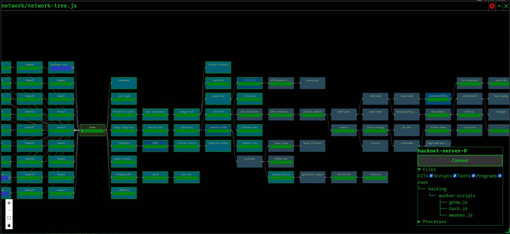

Using the handy [TypeScript template](https://github.com/bitburner-official/typescript-template).

## Server Graph

There's a completely over-engineered server graph using reactflow, a custom memory allocator for script-category-breakdown and a global event system.

## Dependencies
External script-/style dependencies can be loaded through `src/dependencies.json`.
Because of how the game works and certain HTML standard limitations, the dependency system can download and modify script sources at runtime if it needs to.

## Coding contracts
There's an auto-solver for coding contracts (and a parsing system for rewards) under `src/ccts` that can dynamically load solver scripts from `src/ccts/solvers/`.
Currently implemented are:
- Compression I: RLE Compression
- Compression II: LZ Decompression
- Encryption I: Caesar Cipher
- Encryption II: Vigenère Cipher
- Generate IP Addresses

## Useful Breakpoints
See [this repo's Wiki](https://github.com/Mampfinator/bitburner-scripts/wiki/Breakpoints).